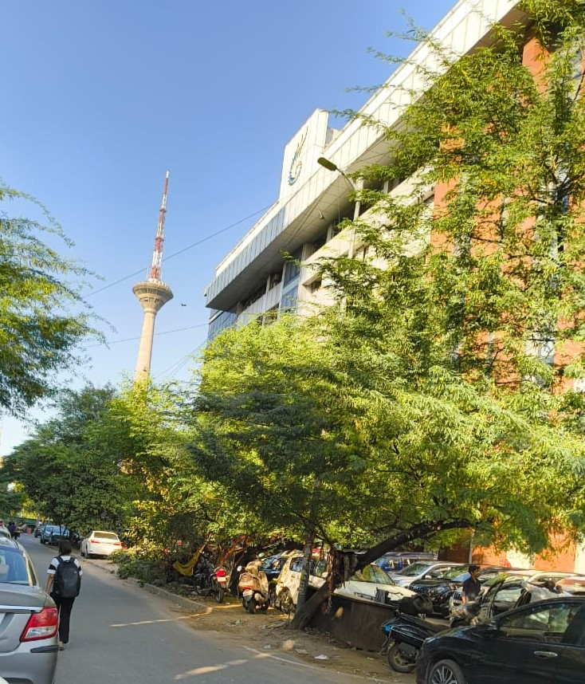
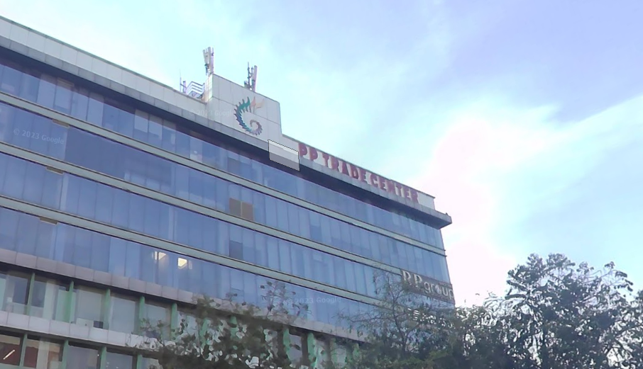

<h1> The Mysterious Building (300 points)</h1>

 Wow, that's a cool tower—I remember it well; saw it when I was on the metro one fine evening. But the building on the right... Something about its logo looks familiar, but I just can’t recall its name. Can you help me figure out the name of this mysterious building? <a href="https://github.com/thredeisacoder/CTF-Write-ups/blob/main/ACECTF_1.0/img/OSINT-1.jpg">OSINT-1.jpg</a> Flag format - ACECTF{building_name}. All lowercase, seperated by underscores instead of spaces. E.g. - ACECTF{white_house}

<a href="https://www.google.com/maps/@28.6937464,77.1489315,3a,60y,321.38h,114.13t/data=!3m7!1e1!3m5!1suyYzbNI4DYzDA0mcRuQ7eQ!2e0!6shttps:%2F%2Fstreetviewpixels-pa.googleapis.com%2Fv1%2Fthumbnail%3Fcb_client%3Dmaps_sv.tactile%26w%3D900%26h%3D600%26pitch%3D-24.130647738226116%26panoid%3DuyYzbNI4DYzDA0mcRuQ7eQ%26yaw%3D321.378037184836!7i13312!8i6656?entry=ttu&g_ep=EgoyMDI1MDIyNC4wIKXMDSoASAFQAw%3D%3D">Location</a>

<h3>Flag: <code>ACECTF{pp-trade-center}</code></h3>
