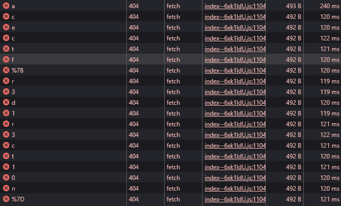

<h1> Flag-Fetcher (200 points)</h1>

 Hey guys, I created a flag fetcher using some web stacks & technologies. It was supposed to fetch the flag.webp image file which contains the flag but there was some kind of error in doing that. Can you verify it? Maybe just get the flag I don't really care if you fix it or not.

Challenge link: <a href="http://34.131.133.224/Flag-Fetcher/">Click here.</a>

This challenge is quite simple. You just need to open DevTools, switch to the Network tab, and check the results.

The website will keep redirecting and eventually end up at <code>/flag.webp</code>. We just need to concatenate the characters together to form the flag.

<h3>Flag: <code>ACECTF{r3d1r3ct10n}</code></h3>
