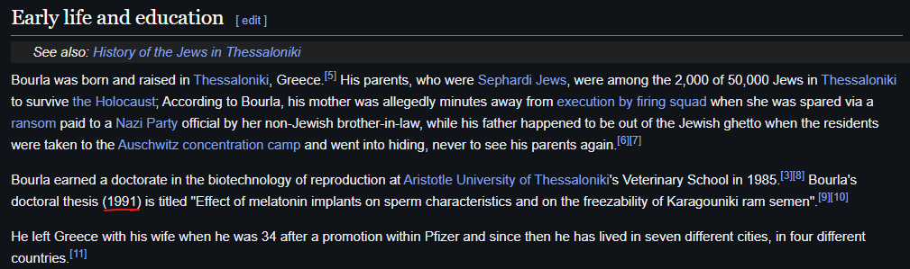

<h1> Compromised Immune System (25 points)</h1>

DEADFACE seems to have gathered information on a pharmaceutical CEO Albert Bourla in an attempt to create a valid work order to Aurora Pharmaceuticals. They claim to have cracked his password by doing a deep dive into his history.

Apparently the password is his dogs names and the day month and year he received “The Golden Cross of the Order of the Redeemer” award and the Year his thesis was published.

We don't know the order the dogs names are listed, but we are sure the 2nd name starts with a capitol letter.

Submit the flag as <code>flag{dog1*year$Dog2+MM-dd-YYYY}</code>.

<h3> Created by: <b>Shamel</b></h3>

<a href="https://www.prnewswire.co.uk/news-releases/2022-genesis-prize-laureate-albert-bourla-receives-top-civilian-honor-from-greece-866373939.html">The day month and year CEO Albert Bourla received “The Golden Cross of the Order of the Redeemer” award.</a>

<a href="https://en.wikipedia.org/wiki/Albert_Bourla">The Year his thesis was published.</a>

<a href="https://www.linkedin.com/posts/albert-bourla_happy-national-pet-day-today-were-giving-activity-7051554863888883712-St5C">Name of dogs.</a>

<h3>Flag: <code>flag{charlie*1991$Simba+04-05-2022}</code></h3>
