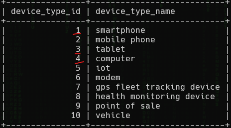

<h1> SkyWave 2: Trifecta (15 points)</h1>
<p> We can assume that <code>d34th</code> used some kind of smart device or computer to conduct his attacks. How many devices in the database are either a smart phone, a computer, or a tablet?<br>Submit the flag as <code>flag{number}</code>. Example: <code>flag{10}</code>.</p>
<blockquote><strong>Note:</strong> Access the database from <b>High Tower</b>.</blockquote>
<h3> Created by: <b>syyntax</b></h3>
<hr>
<p>Determine the <code>device_type_id</code> for smartphones, computers, and tablets in the <code>Device_Types</code> table.</p>

```query
SELECT * FROM Device_Types;
```



<p>Using the <code>device_type_id</code> determined above, display it from the <code>Devices</code> table.</p>

```query
SELECT * FROM Devices WHERE device_type_id IN (1,3,4);
```


<h3>Flag: <code>flag{714}</code></h3>
