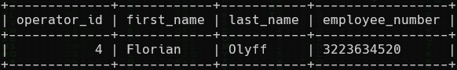
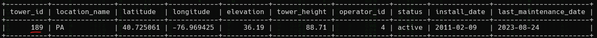
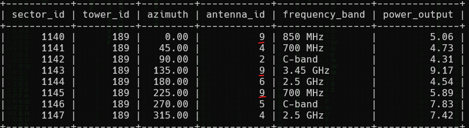
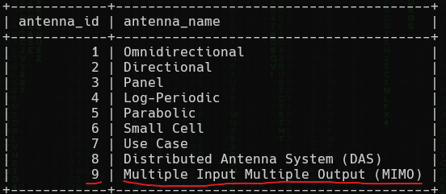

<h1> SkyWave 3: Rabbit Ears (80 points)</h1>
<p> Florian Olyff operates several towers. What is the most commonly used antenna type (name) on the towers she manages?<br>Submit the flag as <code>flag{antenna_name number}</code>. Example: <code>flag{Long Antenna 5}</code>.</p>
<blockquote><strong>Note:</strong> Access the database from <b>High Tower</b>.</blockquote>
<h3> Created by: <b>syyntax</b></h3>
<hr>
<p>Determine Florian Olyff's <code>operator_id</code> from the <code>Operators</code> table.</p>

```query
SELECT * FROM Operators WHERE first_name = "Florian";
```

<p>Find the tower_id she operates.</p>

```query
SELECT * FROM Towers WHERE operator_id = 4;
```

<p>Retrieve the antennas associated with <code>tower_id = 189</code>. Identify that <code>antenna_id = 9</code> is used a maximum of 3 times.</p>

```query
SELECT * FROM Tower_Sectors WHERE tower_id = 189;
```

<p>Finally, determine the name of the antenna.</p>

```query
SELECT * FROM Antennas;
```


<h3>Flag: <code>flag{Multiple Input Multiple Output (MIMO) 3}</code></h3>
