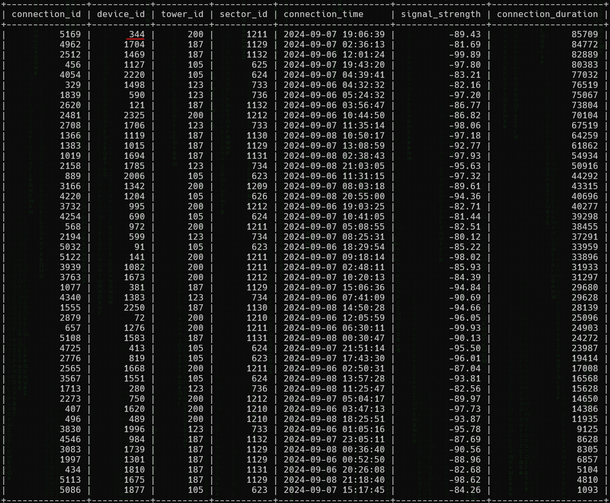

<h1> SkyWave 4: Longest Run (120 points)</h1>
<p> We need to determine which device had the longest running connection out of the towers with the following coordinates:<div>&middot; (41.639642, -79.220682)<br> &middot; (40.598271, -78.801089)<br> &middot; (41.045892, -79.068358)<br> &middot; (41.257279, -77.529468)</div></p>
<p>Additionally, let’s focus on only finding the longest running connection with a dBm greater than -100.</p>
<p>Submit the flag as <code>flag{device_imei}</code>. Example: <code>flag{123456789012345}</code>.</p>
<blockquote><strong>Note:</strong> Access the database from <b>High Tower</b>.</blockquote>
<h3> Created by: <b>syyntax</b></h3>
<hr>
<p>Identify the <code>tower_id</code> in the ranges specified by the challenge.</p>

```query
SELECT * FROM Towers WHERE (latitude = 41.639642 AND longitude = -79.220682) OR (latitude = 40.598271 AND longitude = -78.801089) OR (latitude = 41.045892 AND longitude = -79.068358) OR (latitude = 41.257279 AND longitude = -77.529468);
```

<p>Retrieve all records from the <code>Connections</code> table where the <code>signal_strength</code> is greater than -100 and the <code>tower_id</code> is either 105, 123, 187, or 200. Sort the results by <code>connection_duration</code> from highest to lowest.</p>

```query
SELECT * FROM Connections WHERE signal_strength > -100 AND tower_id IN (105, 123, 187, 200) ORDER BY connection_duration DESC;
```

<p>Finally, identify the <code>device_imei</code> corresponding to the found <code>device_id</code>.</p>

```query
SELECT * FROM Devices WHERE device_id = 344;
```


<h3>Flag: <code>flag{845303290931675}</code></h3>
