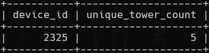
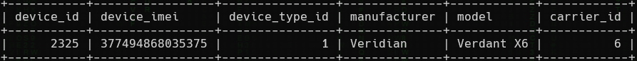

<h1> SkyWave 5: Connections (200 points)</h1>
<p>We’re running with an assumption that <code>d34th</code> drove around and connected to various cell towers the day leading up to the attack.</p>
<p> We need you to determine which device IMEI connected to the most unique towers on <b>September 7 from 16:10 to 18:54</b>.<br>Submit the flag as <code>flag{device_imei}</code>. Example: <code>flag{123456789012345}</code>.</p>
<blockquote><strong>Note:</strong> Access the database from <b>High Tower</b>.</blockquote>
<h3> Created by: <b>syyntax</b></h3>
<hr>
<p></p>

```query
SELECT device_id, COUNT(DISTINCT tower_id) AS unique_tower_count FROM Connections WHERE connection_time BETWEEN '2024-09-07 16:10:00' AND '2024-09-07 18:54:00' GROUP BY device_id ORDER BY unique_tower_count DESC LIMIT 1;
```


```query
SELECT * FROM Devices WHERE device_id = 2325;
```

<p></p>

<h3>Flag: <code>flag{377494868035375}</code></h3>
