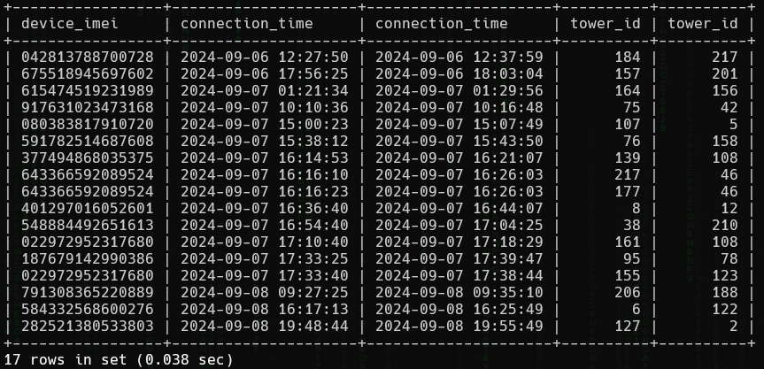

<h1> SkyWave 6: Handoff (220 points)</h1>
<p> Which devices switched between towers within a 5 to 10 minute timespan? Submit the number of connections and the IMEI of the device with the earliest connection time.<br>Submit the flag as <code>flag{number_IMEI}</code>. Example: <code>flag{100_123456789012345}</code>.</p>
<blockquote><strong>Note:</strong> Access the database from <b>High Tower</b>.</blockquote>
<h3> Created by: <b>syyntax</b></h3>
<hr>

```query
SELECT tab1.device_imei, tab1.connection_time, tab2.connection_time, tab1.tower_id, tab2.tower_id FROM (SELECT device_imei, connection_time, tower_id FROM Devices NATURAL JOIN Connections) tab1 INNER JOIN (SELECT device_imei, connection_time, tower_id FROM Devices NATURAL JOIN Connections) tab2 ON ((tab1.device_imei = tab2.device_imei) AND (tab1.connection_time <> tab2.connection_time) AND (tab1.tower_id <> tab2.tower_id)) WHERE (ABS(TIMESTAMPDIFF(MINUTE, tab1.connection_time, tab2.connection_time) BETWEEN 5 AND 10)) ORDER BY tab1.connection_time ASC;
```


<h3>Flag: <code>flag{17_042813788700728}</code></h3>
