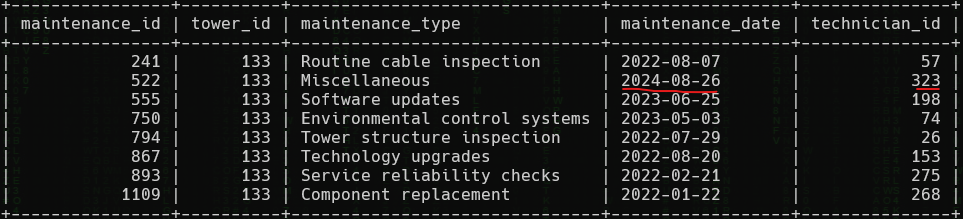
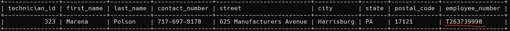

<h1> SkyWave 7: Bad Handwriting (30 points)</h1>
<p> One of the technicians performed maintenance on Tower 133 on August 26, 2024, but the technician's handwriting on the repair log cannot be deciphered. What is the employee number of the employee who conducted maintenance on that tower and on that date?<br>Submit the flag as <code>flag{employee_number}</code>. Example: <code>flag{T123456789}</code>.</p>
<blockquote><strong>Note:</strong> Access the database from <b>High Tower</b>.</blockquote>
<h3> Created by: <b>syyntax</b></h3>
<hr>
<p>Determine which technician performed the maintenance by retrieving the records where <code>tower_id = 133</code> from the <code>Tower_Maintenance</code> table.</p>

```query
SELECT * FROM Tower_Maintenance WHERE tower_id = 133;
```

<p>Using the <code>technician_id</code> from this result, find the corresponding <code>employee_number</code> in the <code>Technicians</code> table.</p>

```query
SELECT * FROM Technicians WHERE technician_id = 323;
```

<h3>Flag: <code>flag{T263739990}</code></h3>
