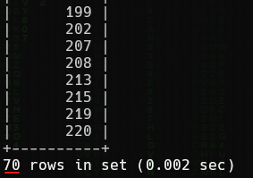

<h1> SkyWave 9: Updates (30 points)</h1>
<p> How many towers received software updates?<br>Submit the flag as <code>flag{number}</code>. Example: <code>flag{10}</code>.</p>
<blockquote><strong>Note:</strong> Access the database from <b>High Tower</b>.</blockquote>
<h3> Created by: <b>syyntax</b></h3>
<hr>

```query
SELECT DISTINCT(tower_id) FROM Tower_Maintenance WHERE maintenance_type = "Software updates";
```

<h3>Flag: <code>flag{70}</code></h3>
