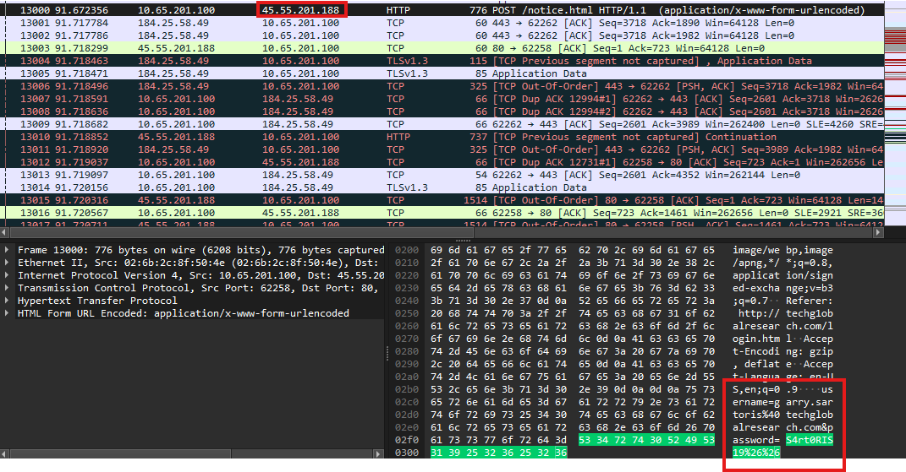

<h1> Big Fish (10 points)</h1>
<blockquote><strong>Disclaimer:</strong> Please note that files extracted from the PCAP may trigger antivirus alerts due to its nature. This is expected in many challenges involving potentially malicious or suspicious code. It is strongly recommended to analyze or execute files in a controlled environment, such as a virtual machine (VM), to ensure the safety of your system. Always exercise caution when handling executable files..</blockquote>
<p> TGRI employee Garry Sartoris fell for a phishing attack recently. It’s hard to say what DEADFACE was after, but Turbo Tactical needs your help looking through the attack artifacts. Take a look at this PCAP and submit the attacker’s IP address.</p>
<a href="../files/phantom.zip">phantom.zip</a>
<p>Submit the flag as <code>flag{IP Address}</code>.</p>
<h3> Created by: <b>syyntax</b></h3>
<hr>

```bash
tshark -r phantom.pcap -Y 'frame contains "pass"'
```




<h3>Flag: <code>flag{45.55.201.188}</code></h3>
