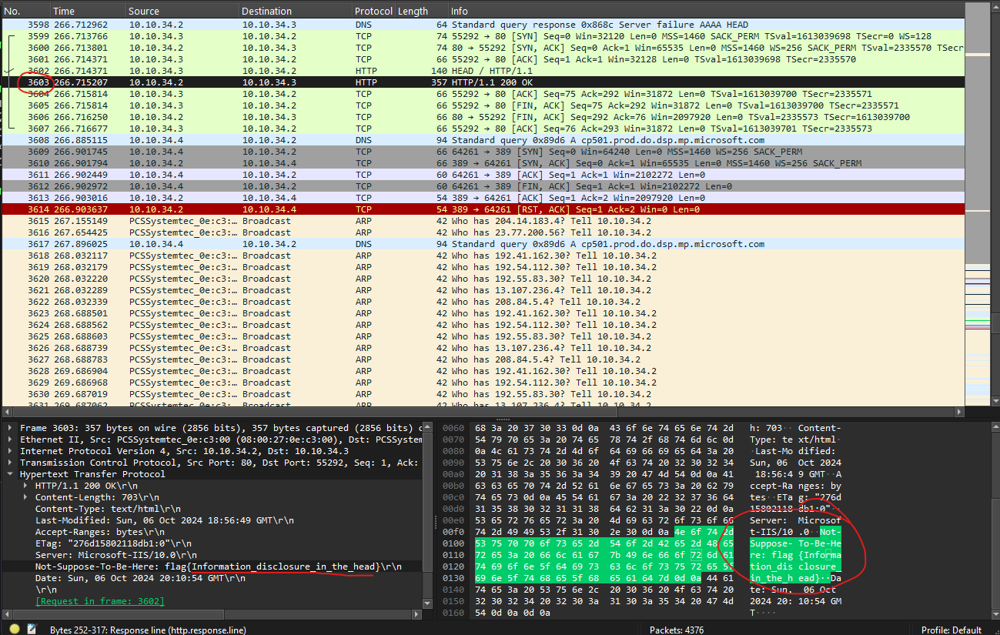

<h1>Data Breach (25 points)</h1>
<p> We suspect an internal employee is leaking sensitive information, but the source remains unclear. We've captured network traffic for analysis. Your mission is to investigate the data and locate the hidden flag.<br> Can we count on your expertise to track it down?</p>
<p>Submit the flag as <code>flag{flag-text}</code>.</p>
<a href="../files/databreach.zip">databreach.zip</a>
<h3> Created by: <b>RP-01?</b></h3>
<hr>

```bash
tshark -r databreach.pcapng -Y 'frame contains "flag"'
```



<h3>Flag: <code>flag{Information_disclosure_in_the_head}</code></h3>
