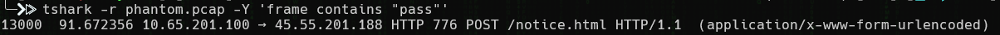
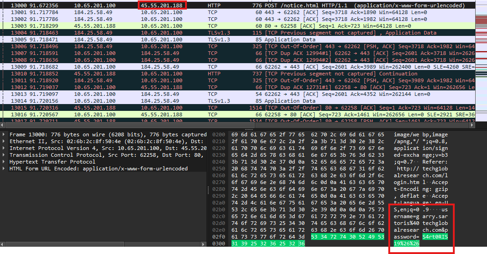

<h1>Password (10 points)</h1>
<blockquote><strong>Note:</strong> Use the PCAP from <b>Big Fish</b>.</blockquote>

 Garry Sartoris provided his credentials to the fake login page. TGRI wants to ensure that their password policy enforces secure practices. What is Garry’s password?

Submit the flag as <code>flag{password}</code>.

<h3> Created by: <b>syyntax</b></h3>

<h3>Flag: <code>flag{S4rt0RIS19&&}</code></h3>
