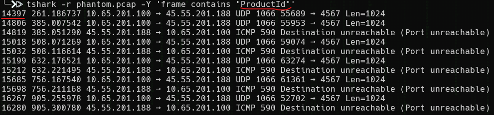
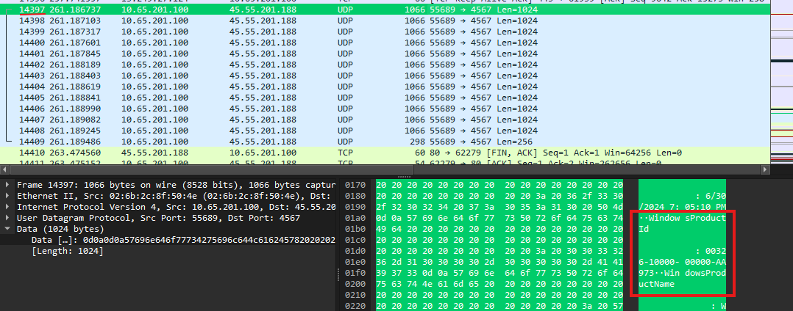

<h1>Product ID (80 points)</h1>
<blockquote><strong>Note:</strong> Use the PCAP from <b>Big Fish</b>.</blockquote>
<p> We suspect that Garry Sartoris was using a non-compliant Windows host and not his work-provided laptop from TGRI. Is there any way to confirm this in the data that DEADFACE exfiltrated? Provide the Windows Product ID of Garry Sartoris’s machine.</p>
<p>Submit the flag as <code>flag{Windows Product ID}</code>. Example: <code>flag{12345-67890-12345-67890}</code>.</p>
<h3> Created by: <b>syyntax</b></h3>
<hr>
```bash
tshark -r phantom.pcap -Y 'frame contains "ProductId"'
```




<h3>Flag: <code>flag{00326-10000-00000-AA973}</code></h3>
