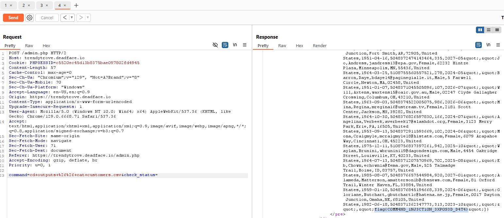

<h1>Compromised Data (300 points)</h1>

 Several victims provided credit card information to TrendyTrove. We believe DEADFACE kept this information on the web server somewhere. See if you can find the flag associated with this data.

Submit the flag as <code>flag{flag-text}</code>.

<h3> Created by: <b>syyntax</b></h3>
<a href="https://trendytrove.deadface.io/">TrendyTrove</a>

This challenge is similar to the Yalonda challenge, but instead of accessing the <code>db-init</code> folder, I navigate to the <code>outputs</code> folder.

There, I find a suspicious <code>customers.csv</code> file, and just as I suspected, the flag was inside.

<h3>Flag: <code>flag{C0MM4ND_1NJ3CT10N_3XP0S3D_D4T4}</code></h3>
