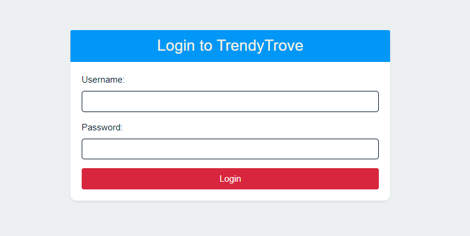
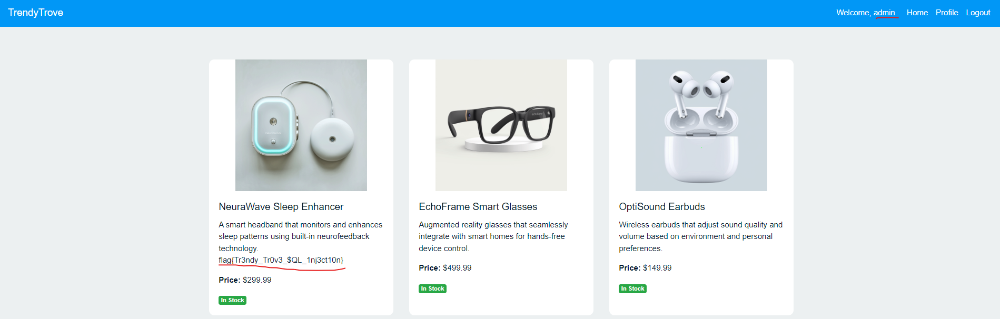

<h1>Let Me In (15 points)</h1>

 DEADFACE is running an e-commerce site in an attempt to scam victims and steal their data and their money! See if you can find a way to access the site. Submit the flag found on the main page.

Submit the flag as <code>flag{flag-text}</code>.

<h3> Created by: <b>syyntax</b></h3>
<a href="https://trendytrove.deadface.io/">TrendyTrove</a>

TThe challenge begins with a login page.

This challenge involves SQL Injection, and I used <code>' OR 1=1--</code> (Fill in both the username and password fields.). I successfully gained admin access.

<h3>Flag: <code>flag{Tr3ndy_Tr0v3_$QL_1nj3ct10n}</code></h3>
