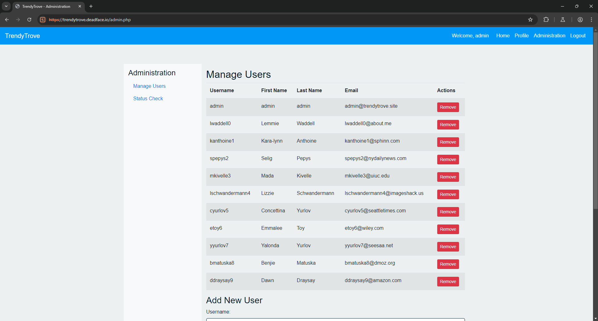
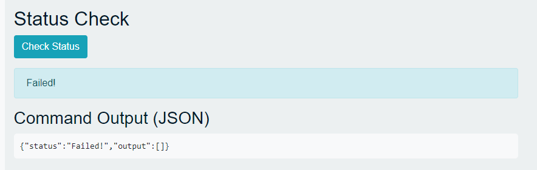
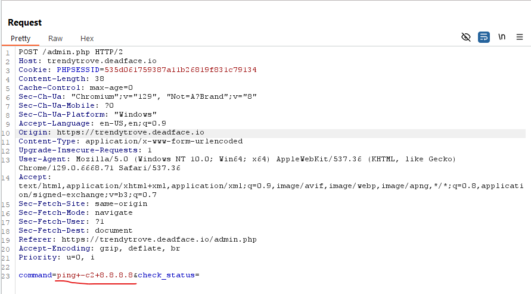
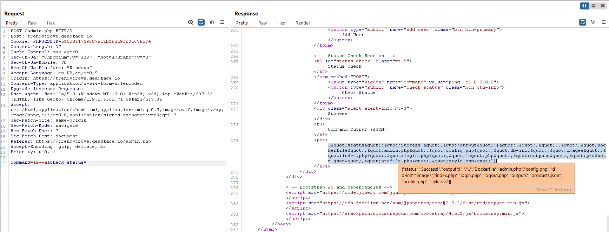
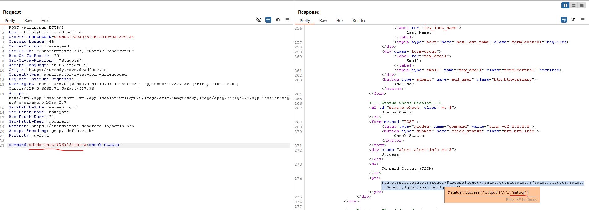
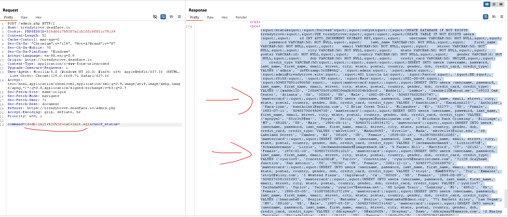
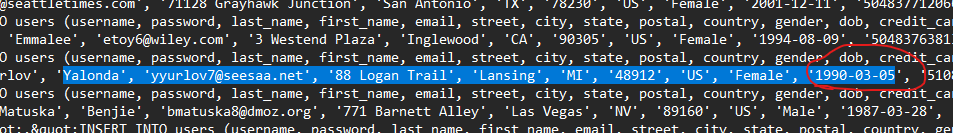

<h1>Yalonda (100 points)</h1>

 One of the victims that fell for DEADFACE's scam is Yalonda Yurlov. Confirm that her data was exposed by submitting her birthdate as the flag.

Submit the flag as <code>flag{MM/DD/YYYY}</code>. (An American wrote this, so keep that in mind when formatting your dates)

<h3> Created by: <b>syyntax</b></h3>
<a href="https://trendytrove.deadface.io/">TrendyTrove</a>

This challenge is a continuation of the previous one. I log in using the same SQL Injection method as in the <b>Let Me In </b>challenge, then access the admin panel at <code>admin.php</code>

I notice two strange functions on the page. After inspecting the source code, I see that only the 'Check Status' function is active. When I click on it, some unusual code appears.

Using Burp Suite to capture the request, I discover that the 'Check Status' function sends a command.

I attempt Command Injection, using <code>ls+-a</code> (which is actually <code>ls -a</code>), and it works.

Next, I use <code>cd+db-init+%26%26+ls+-a</code> (which is <code>cd db-init && ls -a</code>). I find a database file related to the website.

I proceed to read the init.sql file by using <code>cd+db-init+%26%26+cat+init.sql</code>. And wow! All the user information is revealed.

After decoding the HTML entities, I successfully find Yalonda Yurlov's date of birth.

<h3>Flag: <code>flag{03/05/1990}</code></h3>
