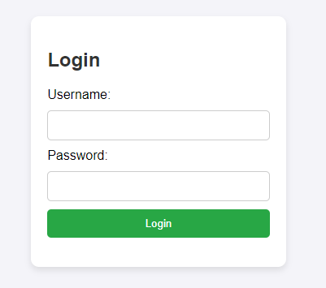
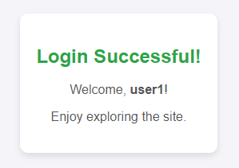
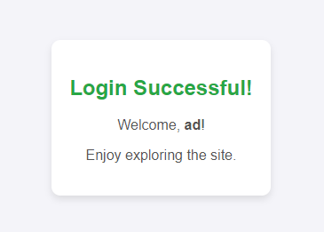
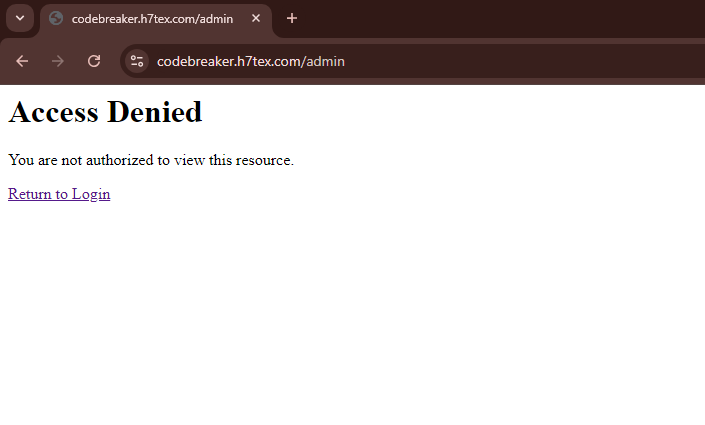
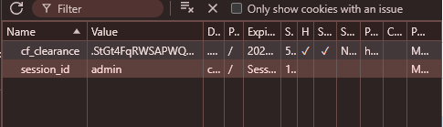
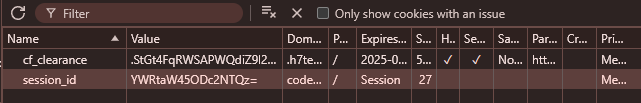
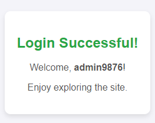
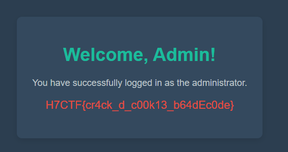

<h1> Code Breaker (150 points)</h1>

 Leaked creds in hand: { 'user1': 'password1', 'user2': 'password2', 'user3': 'password3' } But the Admin panel remains out of reach. "A higher access level requires a sharper mind."

 Author: <b>N1sh</b>

<b>Link: <a href="https://codebreaker.h7tex.com/"> Challenge </a></b>

This challenge starts with a login form. 

My first thought was to exploit it using SQL Injection. However, the challenge reveals 3 accounts to us { 'user1': 'password1', 'user2': 'password2', 'user3': 'password3' }. So, I tried logging in to see what we could find.

After logging in, the website only displays the message 'Login successful' and welcomes us with the username.

In my experience, this part could be exploited through the Cookie section. After logging in to all 3 accounts, each account returned a different section_id value. I decoded those values to see what was hidden inside. All three were 'user' with something resembling a user ID (user1170, user2273, user3193).

I then replaced the value with 'YWRtaW4=' (admin) to see if I could gain administrative privileges. I reloaded the page and this came up.

We're not done yet—we need to access the admin panel to see if the exploit was successful.

It seems our attempt still wasn't successful, as we are still not authenticated.

I logged back in with a random username and changed the value of section_id again, but this time I didn't encode the value in Base64.

I reloaded the page, and boom, the site returned the following error messages:<code>Error: Error decoding session_id: Traceback (most recent call last): File "/app/app.py", line 28, in verify_user decoded_session = base64.b64decode(session_id).decode() ^^^^^^^^^^^^^^^^^^^^^^^^^^^^ File "/usr/local/lib/python3.11/base64.py", line 88, in b64decode return binascii.a2b_base64(s, strict_mode=validate) ^^^^^^^^^^^^^^^^^^^^^^^^^^^^^^^^^^^^^^^^^^^^ binascii.Error: Invalid base64-encoded string: number of data characters (5) cannot be 1 more than a multiple of 4 line 165, in verify_admin if undefined == "admin9876543": verification failed Traceback (most recent call last): File "/app/app.py", line 28, in verify_user decoded_session = base64.b64decode(session_id).decode() ^^^^^^^^^^^^^^^^^^^^^^^^^^^^ File "/usr/local/lib/python3.11/base64.py", line 88, in b64decode return binascii.a2b_base64(s, strict_mode=validate) ^^^^^^^^^^^^^^^^^^^^^^^^^^^^^^^^^^^^^^^^^^^^ binascii.Error: Invalid base64-encoded string: number of data characters (5) cannot be 1 more than a multiple of 4</code>

When reading the error, we can see that the server attempts to decode the Base64 value in section_id. However, since the string I added was not Base64 encoded, it caused the error. Despite this, the error unintentionally revealed how the server authenticates admin rights, and they exposed the admin's value as 'admin9876543'

The next thing we need to do is Base64 encode the string 'admin9876543'(YWRtaW45ODc2NTQz=), change the value in section_id, and reload the page.

Finally, we will be able to access the admin panel.

Flag: <code>H7CTF{cr4ck_d_c00k13_b64dEc0de}</code>
