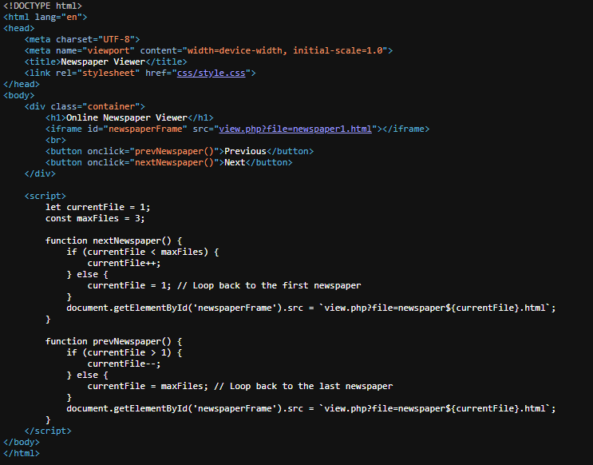
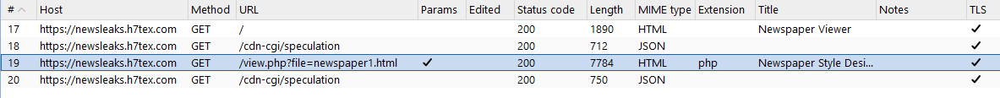
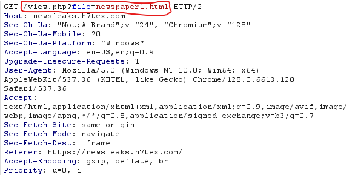
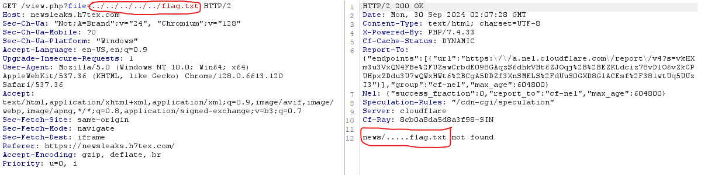
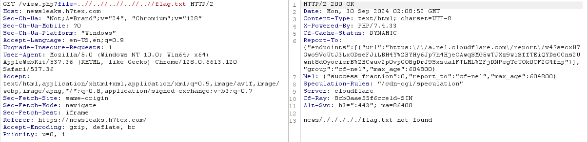
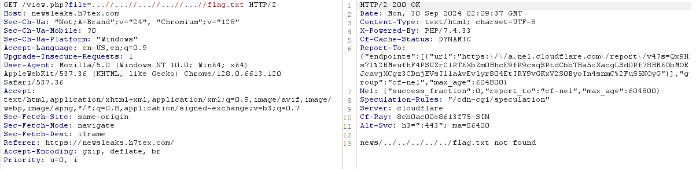
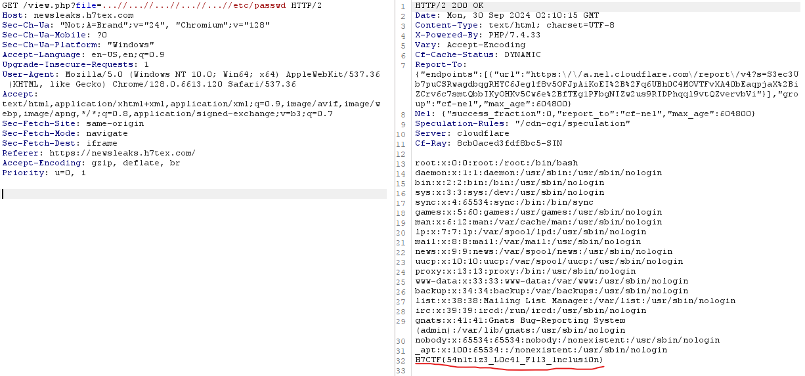

<h1> NewsLeaks (150 points)</h1>

 Keep scrolling, but something feels... off. Can you figure it out?

 Author: <b>N1sh</b>

<b>Link: <a href="https://newsleaks.h7tex.com/"> Challenge </a></b>

When we access the challenge link, we are directed to a website that looks like a newspaper page.

Let's examine the source code of this website.

The website runs a script, but it doesn't seem to be what we are looking to exploit. (This script simply changes the articles when we click 'Next' or 'Previous.').

I will use Burp Suite to capture the packets and see what we find.

Oh! Two packets are sent, and the suspicious one is <code>/view.php?file=newspaper1.html</code>. 

What happens if we pass a different path after <code>?file=</code>? This looks like it could be a <b>Path Traversal</b> vulnerability.

It appears that the filter blocks <code>./</code> when the dots are adjacent, so I will try using <code>...//</code>.

It seems that the flag isn't in the <code>flag.txt</code> file, so let's search for it in <code>/etc/passwd.</code>

Boom! The flag is here.

Flag: <code>H7CTF{54n1t1z3_L0c4l_F1l3_1nclusi0n}</code>
