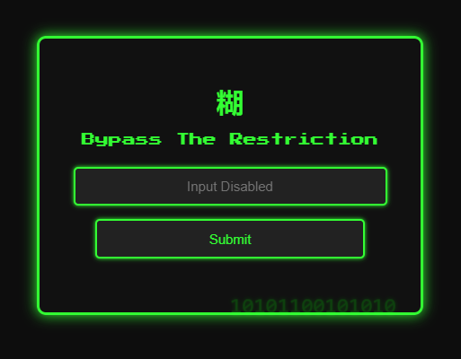
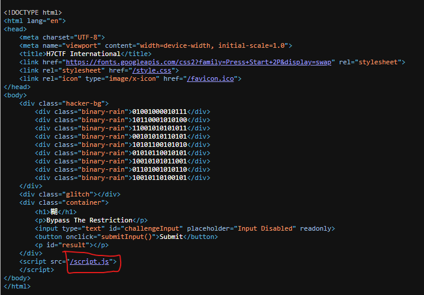

<h1> No Paste (100 points)</h1>
<p> "If you spend too much time thinking about a thing, you'll never get it done. Paste it up, cut it out, and just do it" — Unknown</p>
<p> Author: <b>Abu</b></p>
<b>Link: <a href="https://paste.h7tex.com/"> Challenge </a></b>
<hr>
<p>This challenge starts with a form that can take input like this, but it's disable:</p>

<p> The first thing I did was to look at the source code of the website. </p>

<p>I found out that this website runs a script from a file called <b><code>script.js</code></b>, and below is the source code.</p>

```javascript
const _0x704f72=_0x1bd5;function _0x1bd5(_0x2047f9,_0x357546){const _0xe16b22=_0xe16b();return _0x1bd5=function(_0x1bd527,_0x485649){_0x1bd527=_0x1bd527-0xc4;let _0x5b1899=_0xe16b22[_0x1bd527];return _0x5b1899;},_0x1bd5(_0x2047f9,_0x357546);}function _0xe16b(){const _0x4c3e23=['1324128AFJEVv','7068GqiGjD','challengeInput','2125DmXkHA','result','textContent','value','POST','5588288xDHxaF','bypass123','then','addEventListener','getElementById','/submit?input=','Flag:\x20','error','1026jodAtA','393500Fwnrwo','paste','793504lbHmgC','32613VrGzuS','flag','801iQqFPw','success','keydown','965970xJmNwA'];_0xe16b=function(){return _0x4c3e23;};return _0xe16b();}(function(_0x12ee8f,_0x15ae77){const _0x1e8539=_0x1bd5,_0x29eb23=_0x12ee8f();while(!![]){try{const _0x122b1f=-parseInt(_0x1e8539(0xc7))/0x1+-parseInt(_0x1e8539(0xcd))/0x2+parseInt(_0x1e8539(0xce))/0x3+parseInt(_0x1e8539(0xcf))/0x4*(-parseInt(_0x1e8539(0xd1))/0x5)+parseInt(_0x1e8539(0xc4))/0x6*(-parseInt(_0x1e8539(0xc8))/0x7)+-parseInt(_0x1e8539(0xd6))/0x8+parseInt(_0x1e8539(0xca))/0x9*(parseInt(_0x1e8539(0xc5))/0xa);if(_0x122b1f===_0x15ae77)break;else _0x29eb23['push'](_0x29eb23['shift']());}catch(_0x4a7e8a){_0x29eb23['push'](_0x29eb23['shift']());}}}(_0xe16b,0x66be5));function submitInput(){const _0x138950=_0x1bd5,_0x2f7956=document['getElementById'](_0x138950(0xd0))[_0x138950(0xd4)],_0x52b4bc=_0x138950(0xd7);fetch(_0x138950(0xdb)+encodeURIComponent(_0x2f7956),{'method':_0x138950(0xd5)})[_0x138950(0xd8)](_0x101da1=>_0x101da1['json']())[_0x138950(0xd8)](_0x5c2193=>{const _0x239188=_0x138950,_0xae2c45=document[_0x239188(0xda)](_0x239188(0xd2));_0x5c2193[_0x239188(0xcb)]?_0xae2c45[_0x239188(0xd3)]=_0x239188(0xdc)+_0x5c2193[_0x239188(0xc9)]:_0xae2c45[_0x239188(0xd3)]=_0x5c2193['message'];})['catch'](_0x3c7f8d=>{const _0x84ca33=_0x138950;console[_0x84ca33(0xdd)]('Error:',_0x3c7f8d);});}document['getElementById'](_0x704f72(0xd0))[_0x704f72(0xd9)](_0x704f72(0xc6),_0x2860a8=>_0x2860a8['preventDefault']()),document[_0x704f72(0xda)](_0x704f72(0xd0))[_0x704f72(0xd9)](_0x704f72(0xcc),_0x357fbf=>_0x357fbf['preventDefault']());
```
<p>The code seems a bit difficult to read, so I'll format it to make it easier to understand. </p>

```javascript
const _0x704f72 = _0x1bd5;

function _0x1bd5(_0x2047f9, _0x357546) {
    const _0xe16b22 = _0xe16b();
    return _0x1bd5 = function(_0x1bd527, _0x485649) {
        _0x1bd527 = _0x1bd527 - 0xc4;
        let _0x5b1899 = _0xe16b22[_0x1bd527];
        return _0x5b1899;
    }, _0x1bd5(_0x2047f9, _0x357546);
}

function _0xe16b() {
    const _0x4c3e23 = ['1324128AFJEVv', '7068GqiGjD', 'challengeInput', '2125DmXkHA', 'result', 'textContent', 'value', 'POST', '5588288xDHxaF', 'bypass123', 'then', 'addEventListener', 'getElementById', '/submit?input=', 'Flag:\x20', 'error', '1026jodAtA', '393500Fwnrwo', 'paste', '793504lbHmgC', '32613VrGzuS', 'flag', '801iQqFPw', 'success', 'keydown', '965970xJmNwA'];
    _0xe16b = function() {
        return _0x4c3e23;
    };
    return _0xe16b();
}(function(_0x12ee8f, _0x15ae77) {
    const _0x1e8539 = _0x1bd5,
        _0x29eb23 = _0x12ee8f();
    while (!![]) {
        try {
            const _0x122b1f = -parseInt(_0x1e8539(0xc7)) / 0x1 + -parseInt(_0x1e8539(0xcd)) / 0x2 + parseInt(_0x1e8539(0xce)) / 0x3 + parseInt(_0x1e8539(0xcf)) / 0x4 * (-parseInt(_0x1e8539(0xd1)) / 0x5) + parseInt(_0x1e8539(0xc4)) / 0x6 * (-parseInt(_0x1e8539(0xc8)) / 0x7) + -parseInt(_0x1e8539(0xd6)) / 0x8 + parseInt(_0x1e8539(0xca)) / 0x9 * (parseInt(_0x1e8539(0xc5)) / 0xa);
            if (_0x122b1f === _0x15ae77) break;
            else _0x29eb23['push'](_0x29eb23['shift']());
        } catch (_0x4a7e8a) {
            _0x29eb23['push'](_0x29eb23['shift']());
        }
    }
}(_0xe16b, 0x66be5));

function submitInput() {
    const _0x138950 = _0x1bd5,
        _0x2f7956 = document['getElementById'](_0x138950(0xd0))[_0x138950(0xd4)],
        _0x52b4bc = _0x138950(0xd7);
    fetch(_0x138950(0xdb) + encodeURIComponent(_0x2f7956), {
        'method': _0x138950(0xd5)
    })[_0x138950(0xd8)](_0x101da1 => _0x101da1['json']())[_0x138950(0xd8)](_0x5c2193 => {
        const _0x239188 = _0x138950,
            _0xae2c45 = document[_0x239188(0xda)](_0x239188(0xd2));
        _0x5c2193[_0x239188(0xcb)] ? _0xae2c45[_0x239188(0xd3)] = _0x239188(0xdc) + _0x5c2193[_0x239188(0xc9)] : _0xae2c45[_0x239188(0xd3)] = _0x5c2193['message'];
    })['catch'](_0x3c7f8d => {
        const _0x84ca33 = _0x138950;
        console[_0x84ca33(0xdd)]('Error:', _0x3c7f8d);
    });
}
document['getElementById'](_0x704f72(0xd0))[_0x704f72(0xd9)](_0x704f72(0xc6), _0x2860a8 => _0x2860a8['preventDefault']()), document[_0x704f72(0xda)](_0x704f72(0xd0))[_0x704f72(0xd9)](_0x704f72(0xcc), _0x357fbf => _0x357fbf['preventDefault']());
```
<p>As you can see, the code above has been obfuscated to make it harder to read.<br> I will deobfuscate the code using an online tool (https://deobfuscate.relative.im/), and here is the code after deobfuscation.</p>

```javascript
function submitInput() {
  const _0x2f7956 = document.getElementById('challengeInput').value,
    _0x52b4bc = 'bypass123'
  fetch('/submit?input=' + encodeURIComponent(_0x2f7956), { method: 'POST' })
    .then((_0x101da1) => _0x101da1.json())
    .then((_0x5c2193) => {
      const _0xae2c45 = document.getElementById('result')
      _0x5c2193.success
        ? (_0xae2c45.textContent = 'Flag: ' + _0x5c2193.flag)
        : (_0xae2c45.textContent = _0x5c2193.message)
    })
    .catch((_0x3c7f8d) => {
      console.error('Error:', _0x3c7f8d)
    })
}
document
  .getElementById('challengeInput')
  .addEventListener('paste', (_0x2860a8) => _0x2860a8.preventDefault())
document
  .getElementById('challengeInput')
  .addEventListener('keydown', (_0x357fbf) => _0x357fbf.preventDefault())

```
<p>Upon analyzing the code, we can see that sending a POST request to the endpoint <code>/submit</code> with the parameter <code>?input=</code> set to the value <code>bypass123</code> (e.g., <code>/submit?input=bypass123</code>) may reveal the flag.<br> As expected, this approach worked.</p>


Flag: <code>H7CTF{h@ck_th3_sy$t3m}</code>
