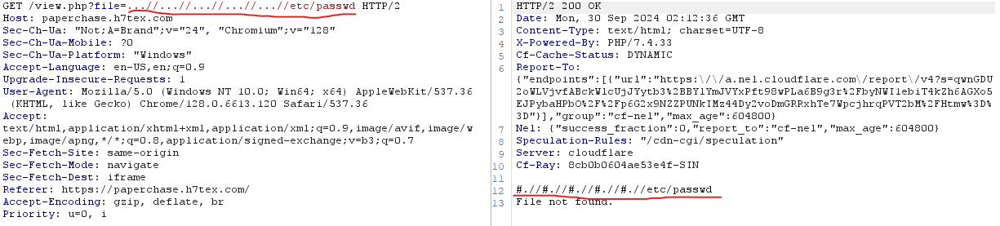
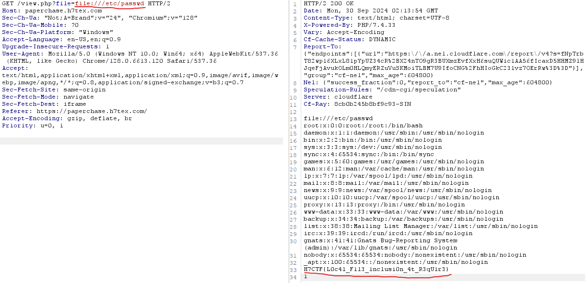

<h1> Paper Chase (200 points)</h1>

 I fixed the leaks! Think you can outsmart the new defenses? Give it another shot!

 Author: <b>N1sh</b>

<b>Link: <a href="https://paperchase.h7tex.com/"> Challenge </a></b>

This challenge is a variation of the 'Newsleaks' challenge, and once again, we will be exploiting Path Traversal.  I attempted the same method as in the previous challenge, but this time, the <code>./</code> characters placed together are filtered and replaced with the <code>#</code> character.

Therefore, we will exploit it differently by using the <code>file://{path}</code> format.

As expected, we succeeded with <code>file:///etc/passwd.</code>

Flag: <code>H7CTF{L0c4l_F1l3_1nclusi0n_4t_R3qU1r3}</code>
