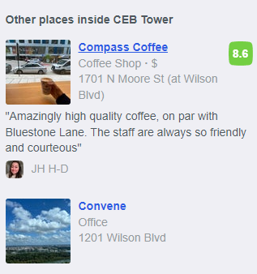

<h1> On The Run (100 points)</h1>
<h3>Easy</h3>

 We've been tracking the adversary for weeks, and he just slipped up and posted this gorgeous high-rise view on his Twitter. His caption was "awesome meeting with a gorgeous view!" Can you track down his location?

 Flag format will be PCTF{<business_name_of_his_location>}. Not a street address. If he were in a WeWork space, it would be PCTF{wework}.

 Author: Shiloh Smiles (arcticx).

 In this challenge, i used Google Lens.

And i found this link: https://foursquare.com/v/the-view-of-dc/5b21564048b04e002c14b64f/photos 

The landing page mentioned some places inside the towel. 

I tried each one.

<h3>Flag: <code>PCTF{convene}</code></h3>
