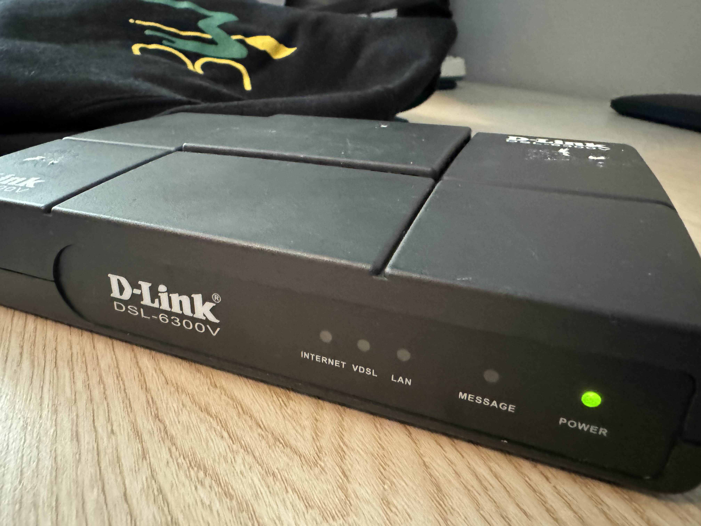

<h1> Phase One (100 points)</h1>
<h3>Easy</h3>

 We had one of our agents infiltrate an adversary's lab and photograph a gateway device that can get us access to their network. We need to develop an exploit as soon as possible. Attached is a picture of the device. Get us intel on what MCU the device is utilizing so we can continue with our research.

 Flag format: pctf{mcu_vendor_name} (example: pctf{broadcom}.

 Author: Dylan (elbee3779)

