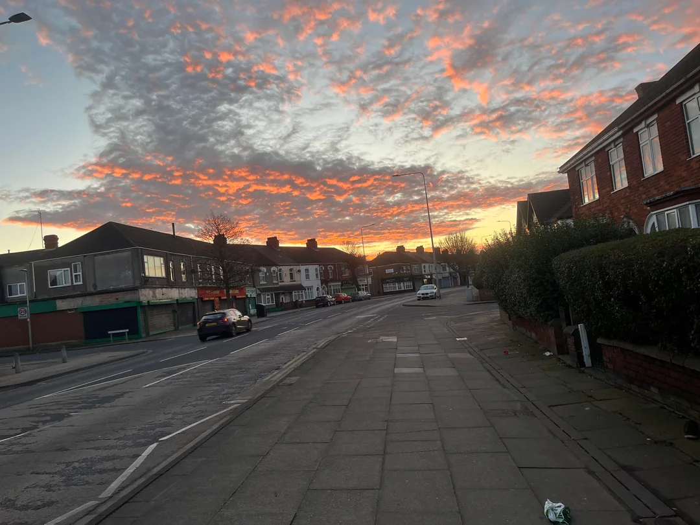

<h1> OSINT 200 - A Tangle a Jingle (200 points)</h1>

 Sometimes I like to try to find the exact location where a photo was taken. A little OSINT exercise I do sometimes to keep my skills sharp. This image was posted to a social media platform last year. I was able to find where it was taken, and if you can too then you will see that there is a business just out of frame, across the street from the building on the corner, to the left of the bollards. The phone number on their sign is the password to the archive (no spaces or special characters.)

File: <a href="./files/OSINT200-2_flag.zip">OSINT200-2_flag.zip</a>

In this challenge, I used Google Lens to search for similar images.

By chance, I found an article containing images that closely resembled the ones in the challenge.  From reading the article(<a href="https://www.grimsbytelegraph.co.uk/news/grimsby-news/man-launched-unprovoked-knife-attack-8755369">Click here</a>), I identified the location as being on a road called Grimsby.

I then used Google Maps to locate this road, and I successfully found it.

<b>Pass: 01472600874</b>

Finally, I used the above password to extract the file containing the flag.

<h3>Flag: <code>poctf{uwsp_1_h4v3_4_dr34m}</code></h3>
