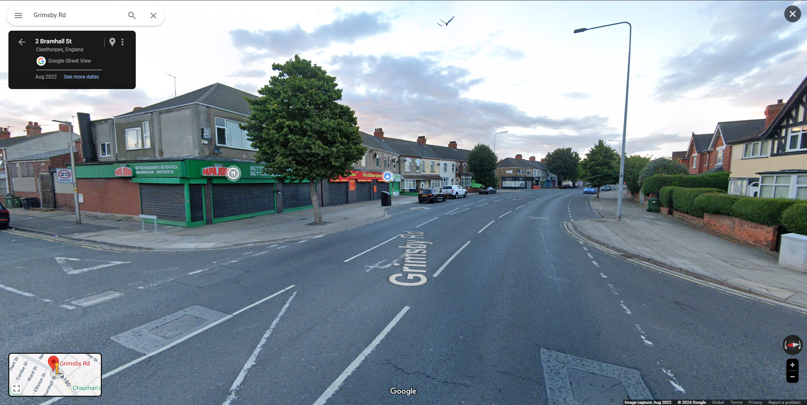
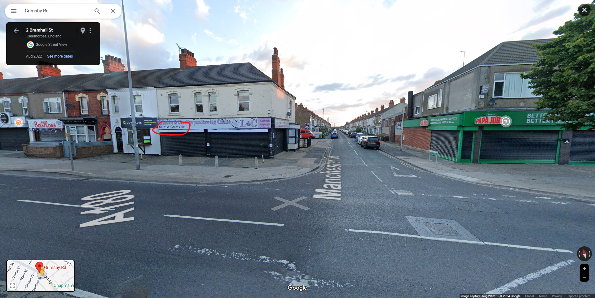

<h1> OSINT 200 - A Tangle a Jingle (200 points)</h1>

 Sometimes I like to try to find the exact location where a photo was taken. A little OSINT exercise I do sometimes to keep my skills sharp. This image was posted to a social media platform last year. I was able to find where it was taken, and if you can too then you will see that there is a business just out of frame, across the street from the building on the corner, to the left of the bollards. The phone number on their sign is the password to the archive (no spaces or special characters.)

File: <a href="./files/OSINT200-2_flag.zip">OSINT200-2_flag.zip</a>

Challenge link: <a href="https://www.grimsbytelegraph.co.uk/news/grimsby-news/man-launched-unprovoked-knife-attack-8755369">Click here.</a>

<b>Pass: 01472600874</b>

<h3>Flag: <code>poctf{uwsp_1_h4v3_4_dr34m}</code></h3>
