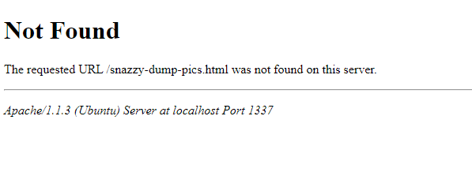
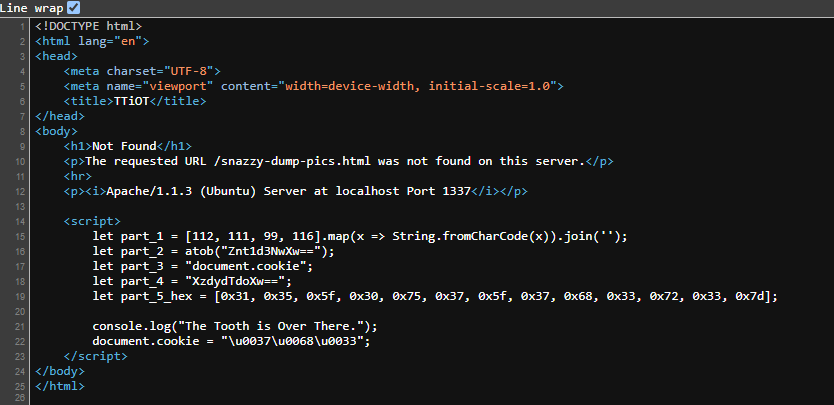

<h1> Web 100 - The Way Out is Through (100 points)</h1>
<p> The first Web challenge of the contest and I am so excited to reveal this one! In this challenge you'll run through a simulated web-based cybersecurity training course a la the DoD Cyber Exchange Awareness Challenge. There's just one problem... The cybersecurity training is... Vulnerable??! Oh, the irony! Can YOU handle the HACK OF THE CENTURY??? Head here to find out!</p>
<p>Challenge link: <a href="http://nvstgt.com/TTiOT/index.html">Click here.</a></p>
<hr>
<p>When accessing the link, we are greeted by an error page, but this is actually just a fake message.</p>

<p>I inspected the page source and discovered a hidden script.</p>



```javascript
let part_1 = [112, 111, 99, 116].map(x => String.fromCharCode(x)).join('');
let part_2 = atob("Znt1d3NwXw==");
let part_3 = "document.cookie";
let part_4 = "XzdydTdoXw==";
let part_5_hex = [0x31, 0x35, 0x5f, 0x30, 0x75, 0x37, 0x5f, 0x37, 0x68, 0x33, 0x72, 0x33, 0x7d];

console.log("The Tooth is Over There.");
document.cookie = "\u0037\u0068\u0033";
```

<p>After solving the five individual parts, I combined them to form the flag.</p>
<code>part1: poct </code>
<code>part2: f{uwsp_ </code>
<code>part3: 7h3 </code>
<code>part4: _7ru7h_ </code>
<code>part5: 15_0u7_7h3r3} </code>


<h3>Flag: <code>poctf{uwsp_7h3_7ru7h_15_0u7_7h3r3}</code></h3>
