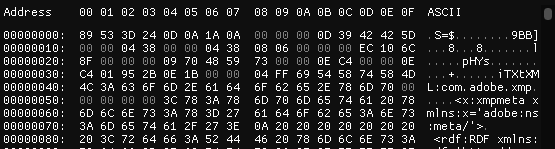
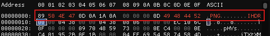

<h1>Something Missing? (100 points)</h1>

Professor got an image from Raquel, but the Intelligence did something!

<h3>Author: <b>TheProfessor </b></h3>
<a href="../files/SomethingMissing">SomethingMissing</a>

I used Imhex tool to solve this challenge. It looks like the structure of a <code>png</code> file.

I decided to change their hex codes to the correct structure of a <code>png</code> file.

I decided to modify the hex codes to match the correct structure of a <code>PNG</code> file.

The flag is located at the bottom edge of the picture.

<h3>Flag: <code>QUESTCON{H1dd3n_s0_y0u_can1_s33}</code></h3>
