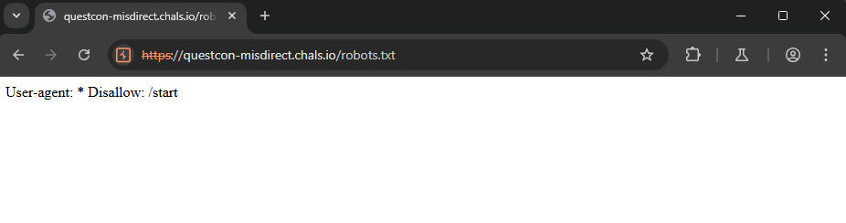
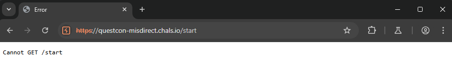
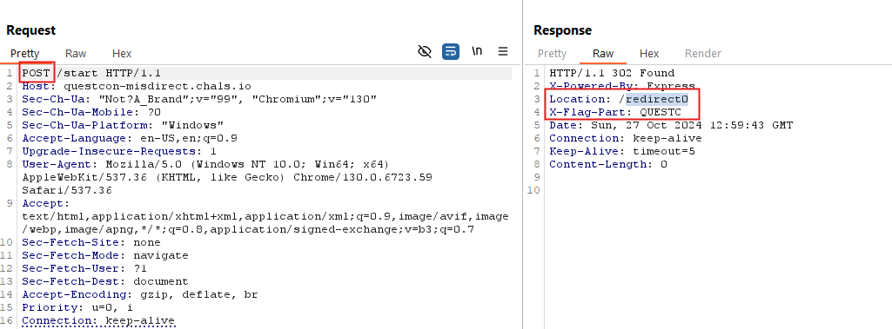
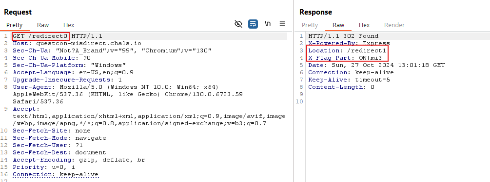
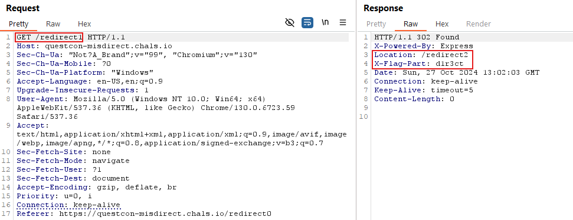
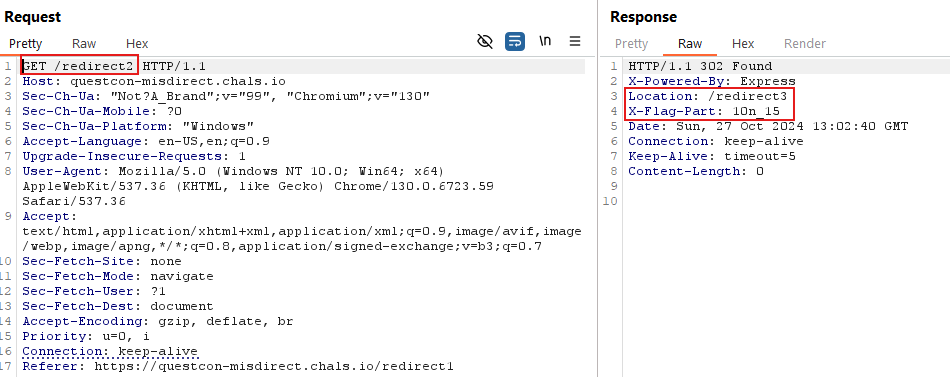
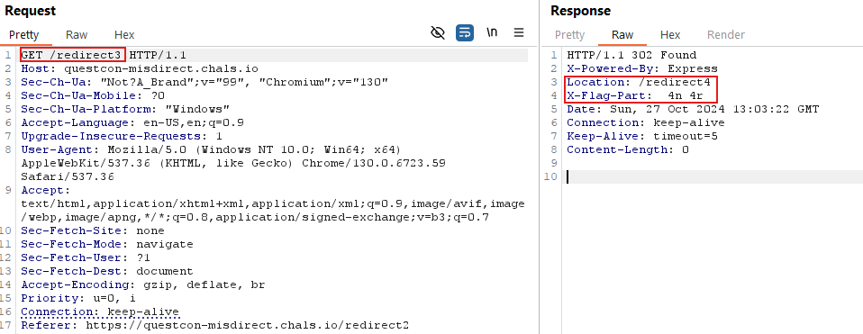

<h1>Direction (100 points)</h1>

Something seems off with the plan displayed on this site. Can you uncover what's hidden behind the scenes and find the way out? The Professor always has a trick up his sleeve.

<h3>Author: <b>TheProfessor </b></h3>
<a href="https://questcon-misdirect.chals.io">https://questcon-misdirect.chals.io</a>

I found a <code>robots.txt</code> file containing the <code>/start</code> endpoint.

Attempting to access it with the GET method was blocked, so I tried using the POST method instead.

After accessing, it continuously redirects through <code>/redirect0</code>, <code>/redirect1</code>, <code>/redirect2</code>, <code>/redirect3</code>, and finally stops at <code>/redirect4</code>.

Each redirection provides a part of the flag.

<h3>Flag: <code>QUESTCON{mi3d1r3ct10n_15_4n_4r}</code></h3>
